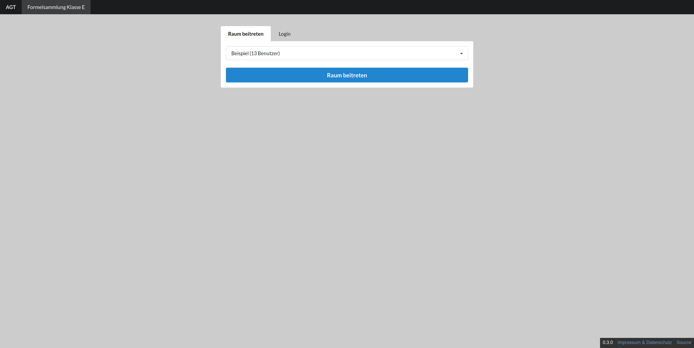
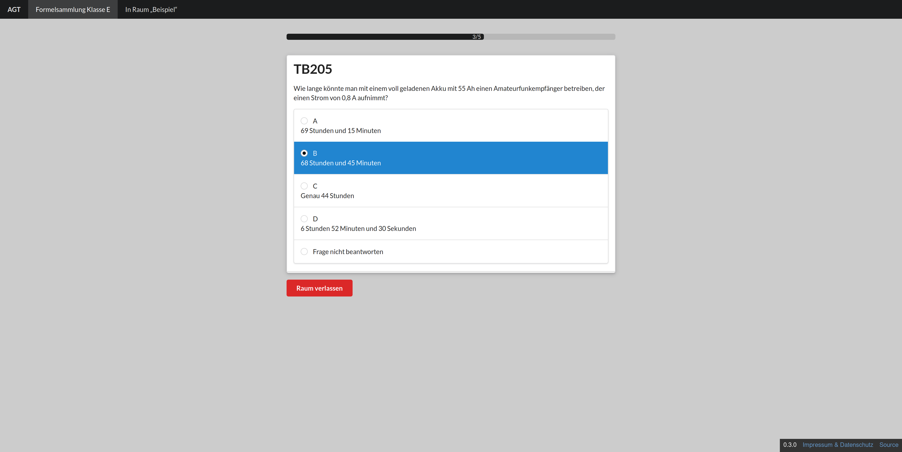
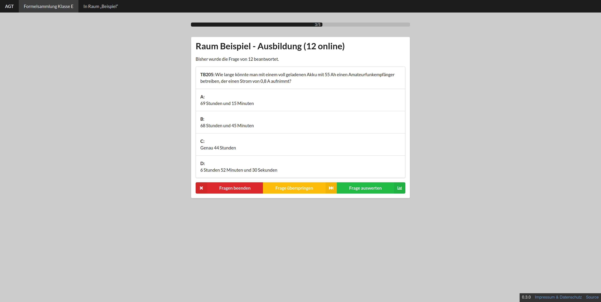
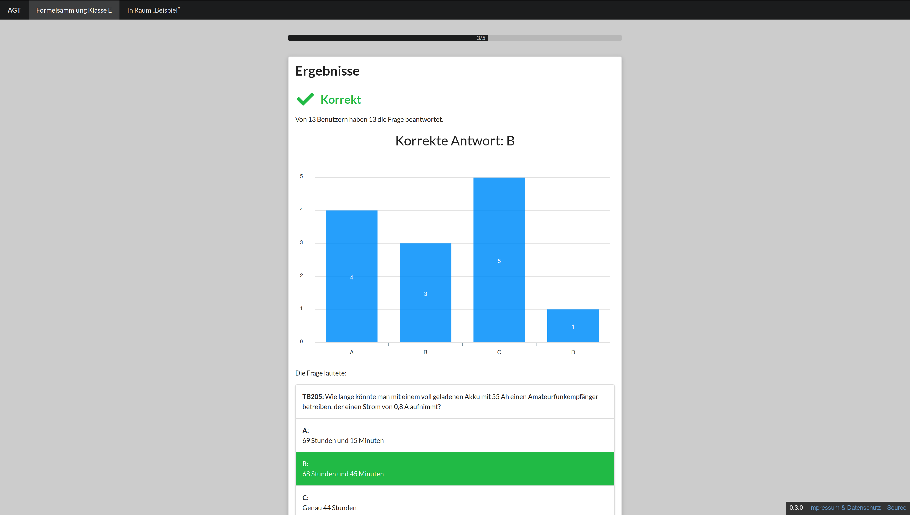
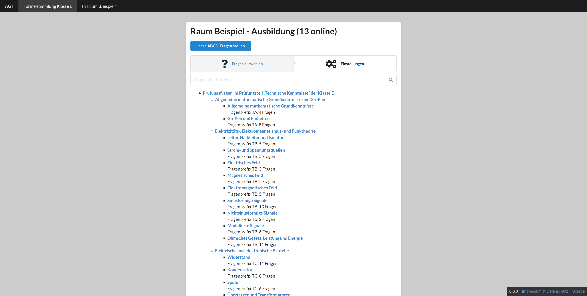
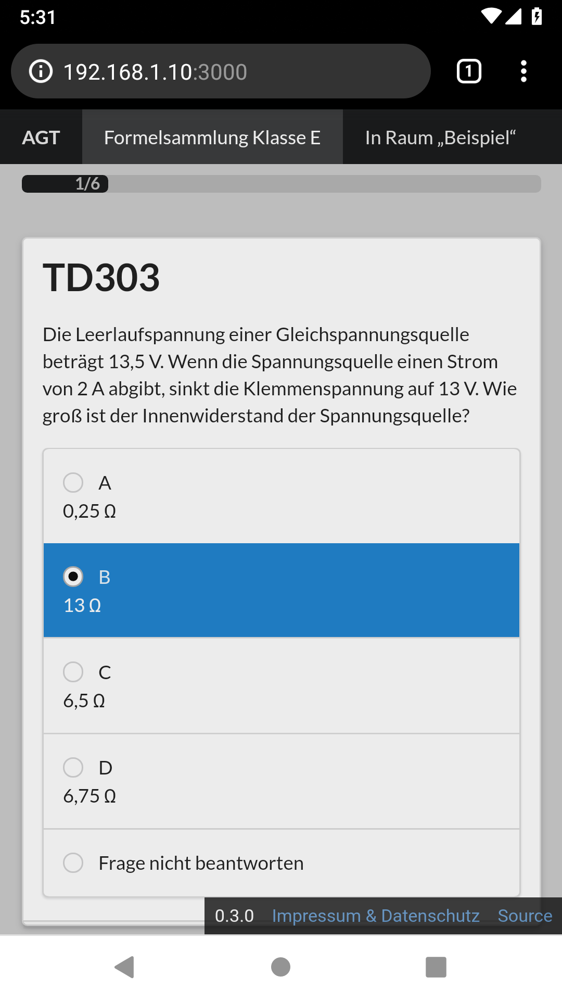
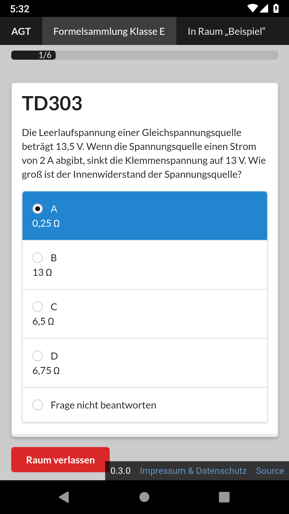

# AFU Group Trainer
Diese Software soll das gemeinsame Lernen für die AFU-Prüfung ermöglichen. Die Idee ist, dass bei einem Lernabend jeder die Frage beantwortet, anstatt dass sich nur einer meldet. Dadurch sollen Schwächen schneller erkannt und der Lerneffekt verbessert werden.

## Links
[Offizielle Instanz](https://agt.dl5lq.de/)

[Dokumentation](https://agt.dl5lq.de/doc/)

[Changelog](https://agt.dl5lq.de/doc/documentation/changelog.html)

## Screenshots

